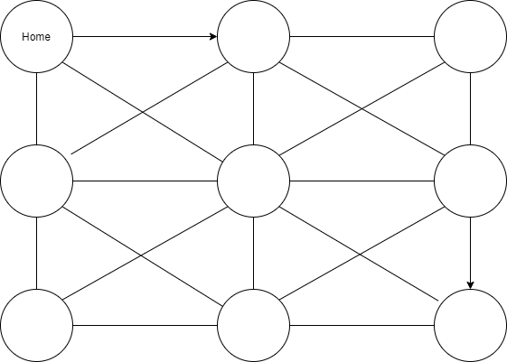

# ECEMasterProject
<!-- ## RL Scenario -->

## Purpose

In situations of natural disasters/phenomenons, blackouts can occur. To combat this, EV (electric vehicles) drivers can use their vehicles as batteries for customers/ clients. To simulate the difficulty of this challenge of getting to as much customers as possible until the blackout period is over, a RL environment was created. This environment will feature random scenarios based on node network size, amount of the houses (can't be larger than node size), blackout data, and housing models.

## Task for Agent

Start at "Home" (a node) travel to each location in exchange for energy (main resource for EV),
unload energy in exchange for energy, travel back to home in exchange for energy. The agent can restore energy at "Home".
Once power is restored in at a node with a power charging station, the agent can restore energy there as well. Some nodes will be empty debating on parameters.

## Reward

Reward given for unloading, recharging.
Diversity of power restoration will result in more reward.
Reward lost for running out of energy.
Episode is over when EV is out of energy or network is completely powered.

## Action & State Space

    Each Agent will have 3 actions per "Day" and a limit of 8 days max.

    10 Actions:
        8 - Move (at Cost): Left, Right, Up, Down, etc
        1 - Unload (at cost)
        1 - Recharge (no cost, expect an action)

    n+e States:
        n - Statuses of Each Node
            Key - Assignment
            0 - Buffer
            1 - Blackout
            2 - Blackout with Solar
            3 - Powered
            4 - Charging Station
            5 - Home

        e - Cost of each edge
            <!-- i - Cost of Edge -->
        
    where n is the number of nodes, e is the number of edges
    <!-- , and i is the cost.  -->

## Logic

Each nodes will be based on a house dataset. Some houses that are solar powered will need less power from EVs compared to non-solar powered homes. The cost will be derive from the housing model.

Percentage of blackout based on texas blackout data, as well as change per day.

At a minimum a **Q-Learning** will be use to find the best solutions.

## Scalability

Can be scaled to multiple EV (MARL would be needed), & a larger network.

## Extras Ideas

Some edges can be blocked off and restored later as days pass (simulate for natural disasters)

DRL and Classic Optimization techniques
